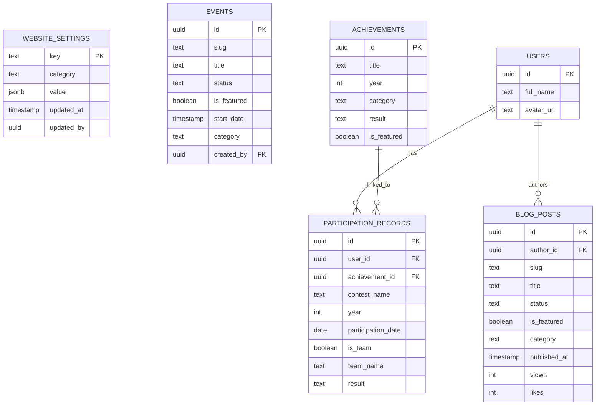
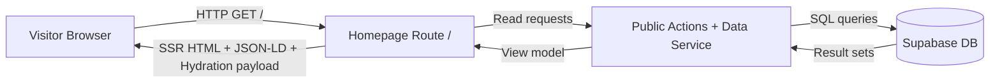
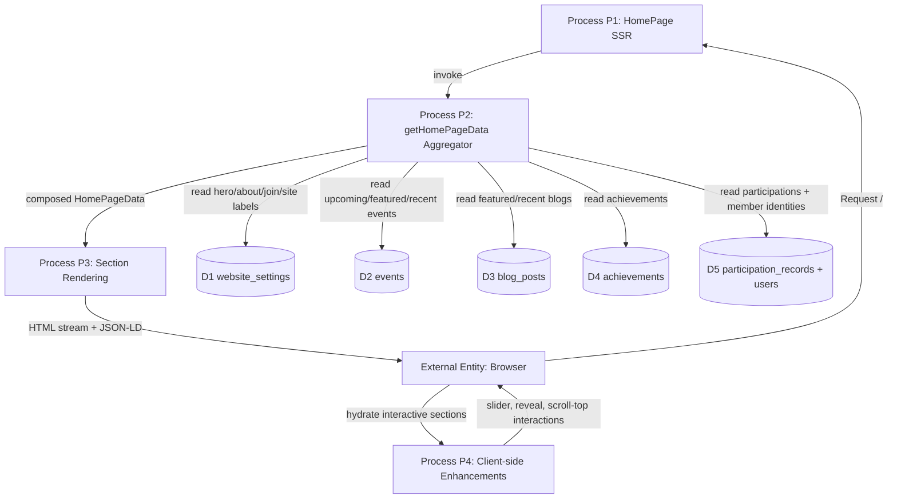
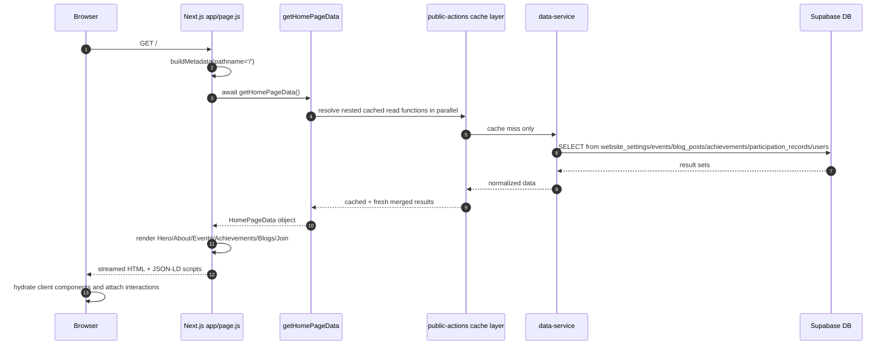

# Root Homepage (/): Professional Technical Documentation

Last Updated: April 9, 2026  
Owner: NEUPC Engineering  
Scope: Only the root page route `/` (`http://localhost:3000/`)

---

## 1) Purpose and Scope

This document defines the complete technical specification for the root homepage only.

In scope:

- Route entry and metadata generation
- Server-side data orchestration for homepage sections
- Component-by-component responsibilities and input contracts
- Root-page database entity model (ER diagram)
- Root-page request and data movement (Data Flow + Sequence)
- Performance, reliability, accessibility, SEO, and testing guidance

Out of scope:

- Dashboard/account routes (`/account/*`)
- Admin write workflows
- Other public routes (`/events`, `/blogs`, `/achievements`, etc.)

---

## 2) Source of Truth Files (Root Page Only)

Primary files:

- `app/page.js`
- `app/_lib/public-actions.js` (`getHomePageData` and nested fetchers)
- `app/_lib/data-service.js` (read-only queries used by homepage)
- `app/_lib/seo.js`

Root-page section components:

- `app/_components/sections/Hero.js`
- `app/_components/sections/About.js`
- `app/_components/sections/Events.js`
- `app/_components/sections/FeaturedEventSlider.js`
- `app/_components/sections/Achievements.js`
- `app/_components/sections/Blogs.js`
- `app/_components/sections/FeaturedBlogSlider.js`
- `app/_components/sections/Join.js`

Shared UI/wrapper components used directly on root page:

- `app/_components/ui/Wave.js`
- `app/_components/ui/ScrollToTop.js`
- `app/_components/ui/JsonLd.js`
- `app/_components/motion/MotionSection.js`

## 2.1) Editable Diagram Source (.drawio)

All diagrams in this document are available as editable Draw.io files:

- Multi-page bundle: [docs/architecture/diagrams/homepage-root-page-diagrams.drawio](docs/architecture/diagrams/homepage-root-page-diagrams.drawio)
- Runtime Flow: [docs/architecture/diagrams/homepage-runtime-flow.drawio](docs/architecture/diagrams/homepage-runtime-flow.drawio)
- ER Diagram: [docs/architecture/diagrams/homepage-er-diagram.drawio](docs/architecture/diagrams/homepage-er-diagram.drawio)
- DFD Level 0: [docs/architecture/diagrams/homepage-dfd-level-0.drawio](docs/architecture/diagrams/homepage-dfd-level-0.drawio)
- DFD Level 1: [docs/architecture/diagrams/homepage-dfd-level-1.drawio](docs/architecture/diagrams/homepage-dfd-level-1.drawio)
- Request Sequence: [docs/architecture/diagrams/homepage-request-sequence.drawio](docs/architecture/diagrams/homepage-request-sequence.drawio)

---

## 3) Runtime Architecture (Route `/`)

### 3.1 High-Level Flow

```mermaid
flowchart TB
  U[Browser: GET /] --> R[Next.js App Router: app/page.js]
  R --> M[buildMetadata in seo.js]
  R --> H[getHomePageData - unstable_cache 300s]

  H --> H1[getHeroData - cache 3600s]
  H --> H2[getAboutData - cache 3600s]
  H --> H3[getPublicUpcomingEvents(6) - cache 300s]
  H --> H4[getPublicFeaturedEvents - cache 300s]
  H --> H5[getPublicRecentEvents(3) - cache 300s]
  H --> H6[getPublicAchievements - cache 300s]
  H --> H7[getPublicParticipations - cache 300s]
  H --> H8[getPublicFeaturedBlogs - cache 300s]
  H --> H9[getPublicRecentBlogs(6) - cache 300s]
  H --> H10[getJoinPageData - cache 3600s]
  H --> H11[getAllPublicSettings - cache 3600s]

  H1 --> DS[data-service.js]
  H2 --> DS
  H3 --> DS
  H4 --> DS
  H5 --> DS
  H6 --> DS
  H7 --> DS
  H8 --> DS
  H9 --> DS
  H10 --> DS
  H11 --> DS

  DS --> DB[(Supabase PostgreSQL)]

  H --> V[Render HomePage sections]
  V --> S[HTML streaming response]
  S --> C[Client hydration for interactive components]
```

### 3.2 Architectural Characteristics

- Server-first rendering: route component is async server component.
- Read-only public data path: no mutation on root page.
- Parallel fetch orchestration with `Promise.all` in `getHomePageData`.
- Layered cache model:
  - Section-level caches (300s or 3600s)
  - Aggregate homepage cache (300s)
- Graceful degradation:
  - Any fetch failure returns safe defaults and empty arrays.

---

## 4) Component Decomposition (Documenting Each Part)

| Part | File | Type | Purpose | Primary Inputs | Fallback Behavior |
|---|---|---|---|---|---|
| Metadata | `app/page.js` + `app/_lib/seo.js` | Server | Build canonical SEO metadata for `/` | Static title/description/keywords | Uses global SEO defaults if optional fields missing |
| Structured Data | `app/_components/ui/JsonLd.js` | Server | Inject Organization + Website JSON-LD | Environment URL + static org info | Uses default base URL |
| Background Image | `app/page.js` | Server | Full-screen visual identity | `bg.webp`, `settings.site_name` for alt | Alt defaults to `NEUPC` |
| Background Overlays | `app/page.js` (`BackgroundOverlays`) | Server | Readability, depth, contrast over background image | None | Always deterministic |
| Hero | `app/_components/sections/Hero.js` | Server | First-fold identity + CTAs | `hero`, `settings` | Uses hardcoded defaults for title/subtitle/department/university |
| Wave Separator | `app/_components/ui/Wave.js` | Server | Visual transition between sections | None | Static SVG |
| About | `app/_components/sections/About.js` | Client | Club overview with reveal animation | `about`, `settings` | Uses default copy values and logo |
| Events | `app/_components/sections/Events.js` | Client (wrapped in MotionSection) | Featured slider + recent cards + CTA | `events`, `featuredEvents`, `recentEvents`, `settings` | Empty-state message when no content |
| Achievements | `app/_components/sections/Achievements.js` | Client (wrapped in MotionSection) | Stats cards + featured achievement slider | `achievements`, `participations`, `stats`, `settings` | Derives zero-state stats and empty featured message |
| Blogs | `app/_components/sections/Blogs.js` | Client (wrapped in MotionSection) | Featured blog slider + recent article grid | `featuredBlogs`, `recentBlogs`, `settings` | Empty-state message and CTA remains available |
| Join | `app/_components/sections/Join.js` | Client (wrapped in MotionSection) | Membership benefits and CTA conversion block | `joinBenefits`, `settings` | Uses default benefits array when settings are absent |
| Scroll To Top | `app/_components/ui/ScrollToTop.js` | Client | UX aid after vertical scroll | Window scroll position | Hidden until scroll threshold reached |

---

## 5) Data Contract for `getHomePageData`

```ts
interface HomePageData {
  hero: {
    title: string;
    subtitle: string;
    department: string;
    university: string;
  };
  about: {
    title: string;
    description1: string;
    description2: string;
    mission: unknown[];
    vision: unknown[];
    whatWeDo: unknown[];
    stats: unknown[];
    coreValues: unknown[];
    orgStructure: unknown[];
    skills: unknown[];
    skillsDescription: string;
    wieTitle: string;
    wieDescription: string;
    mentorshipTitle: string;
    mentorshipDescription: string;
    mentorshipAreas: unknown[];
    orgFinancialNote: string;
  };
  events: Event[];
  featuredEvents: Event[];
  recentEvents: Event[];
  achievements: Achievement[];
  participations: ParticipationRecord[];
  featuredBlogs: BlogPost[];
  recentBlogs: BlogPost[];
  stats: unknown[]; // currently about.stats alias
  joinBenefits: unknown[];
  settings: Record<string, unknown>;
}
```

Implementation notes:

- The function resolves all datasets in parallel, then composes a single payload.
- If any unexpected exception occurs, it falls back to a safe object with defaults and empty arrays.

---

## 6) Data Source Matrix (Homepage Scope)

| Home payload field | Public action function | Data-service function(s) | Table(s) |
|---|---|---|---|
| `hero` | `getHeroData` | `getSettingsByCategory('hero')` | `website_settings` |
| `about` | `getAboutData` | `getSettingsByCategory('about')` | `website_settings` |
| `events` | `getPublicUpcomingEvents(6)` | `getUpcomingEvents` | `events` |
| `featuredEvents` | `getPublicFeaturedEvents` | `getFeaturedEvents` | `events` |
| `recentEvents` | `getPublicRecentEvents(3)` | `getRecentNonFeaturedEvents` | `events` |
| `achievements` | `getPublicAchievements` | `getAllAchievements` | `achievements` |
| `participations` | `getPublicParticipations` | `getPublicParticipationRecords` | `participation_records`, `users`, `achievements` |
| `featuredBlogs` | `getPublicFeaturedBlogs` | `getFeaturedBlogPosts` | `blog_posts`, `users` |
| `recentBlogs` | `getPublicRecentBlogs(6)` | `getRecentNonFeaturedBlogPosts` | `blog_posts`, `users` |
| `joinBenefits` | `getJoinPageData` | `getSetting('join_benefits')` | `website_settings` |
| `settings` | `getAllPublicSettings` | `getAllSettings` | `website_settings` |

---

## 7) ER Diagram (Root-Page Data Model)

This ERD is intentionally scoped to entities read by route `/`.



Design notes:

- `website_settings` acts as the CMS-like config backbone for Hero/About/Join and section labels.
- Root page reads only published/featured slices from content tables.
- Join fetches selected user/achievement fields for public display cards.

---

## 8) Data Flow Diagram (DFD)

### 8.1 DFD Level 0 (Context)



### 8.2 DFD Level 1 (Internal to Root Page)



---

## 9) Request Sequence (Professional Lifecycle)



---

## 10) Non-Functional Design Notes

### 10.1 Performance

Current strengths:

- Parallelized server reads via `Promise.all`
- Multi-level caching (`unstable_cache`) with targeted revalidation windows
- Server component delivery minimizes client JS for static parts

Recommendations:

1. Add field-level select minimization for `events`/`achievements` if payload growth increases.
2. Add response timing logs around `getHomePageData` for p95 tracking.
3. Consider image priority policy audit for largest contentful paint (LCP).

### 10.2 Reliability

Current strengths:

- Safe fallback object when homepage aggregate fetch fails
- Per-function try/catch with empty defaults
- UI-level empty states in Events/Blogs/Achievements

Recommendations:

1. Capture structured server logs on aggregate failure path with route tag `/`.
2. Add alerting for repeated fallback-path usage.

### 10.3 Security

Current strengths:

- Root page is read-only and public
- No client-side secrets in route code

Important boundary:

- Some reads use admin-capable service access inside server-only modules; ensure this remains server-isolated and never imported in client bundles.

### 10.4 Accessibility

Current strengths:

- Semantic sections and labeled controls
- Alt text and meaningful CTA labels
- Reduced-motion support in motion wrappers

Recommendations:

1. Validate color contrast for all gradient text over dark overlays.
2. Add keyboard focus walkthrough in E2E tests for sliders and CTA controls.

### 10.5 SEO

Current strengths:

- Canonical metadata generation
- OpenGraph/Twitter metadata
- Organization and Website JSON-LD scripts

Recommendations:

1. Add structured-data snapshot tests to prevent accidental schema regressions.
2. Verify production URL consistency via `NEXT_PUBLIC_SITE_URL`.

---

## 11) Testing Strategy for Root Page

### 11.1 Unit Tests

Target units:

- `parseJsonSetting` behavior for object/string/invalid JSON/null
- `deriveStats` and medal parsing in Achievements section
- Excerpt/read-time helpers in Blogs section

### 11.2 Integration Tests

Suggested integration coverage:

1. `getHomePageData` returns complete object shape with empty-safe defaults.
2. Cache behavior: repeated calls within TTL return stable payload.
3. Error path: simulated DB exception still renders root page without crash.

### 11.3 End-to-End Tests

Suggested route-level checks for `/`:

1. Hero heading and CTA buttons are visible.
2. Section order is preserved: Hero -> About -> Events -> Achievements -> Blogs -> Join.
3. Featured sliders are interactive with keyboard and mouse.
4. Scroll-to-top button appears after threshold and returns to top.
5. Structured data script tags exist in rendered HTML.

### 11.4 Performance and Quality Gates

Suggested CI gates:

- LCP budget target under agreed threshold
- No critical accessibility violations (axe)
- No uncaught runtime errors in root page rendering

---

## 12) Change Management Checklist (For Future Homepage Updates)

Before merge:

1. Confirm data contract changes in `getHomePageData` are backward compatible with section props.
2. Update this document if section order, data sources, or ER relations change.
3. Re-run route-level E2E and accessibility checks.
4. Validate SEO metadata and JSON-LD output in rendered HTML.
5. Verify empty-state UX for each section remains user-friendly.

---

## 13) Summary

The root page is implemented as a server-first, cache-optimized composition route that aggregates public content and settings into one stable view model. Its architecture is robust for high-read public traffic, with clear section boundaries, graceful fallbacks, and strong SEO foundations. The ER and DFD models above document exactly how root-page data is structured and moved through the system.
