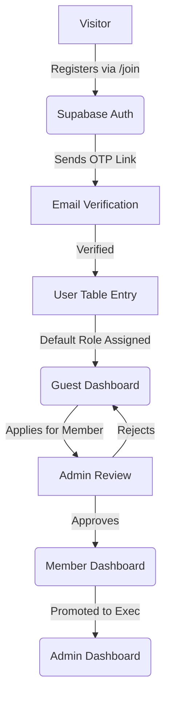
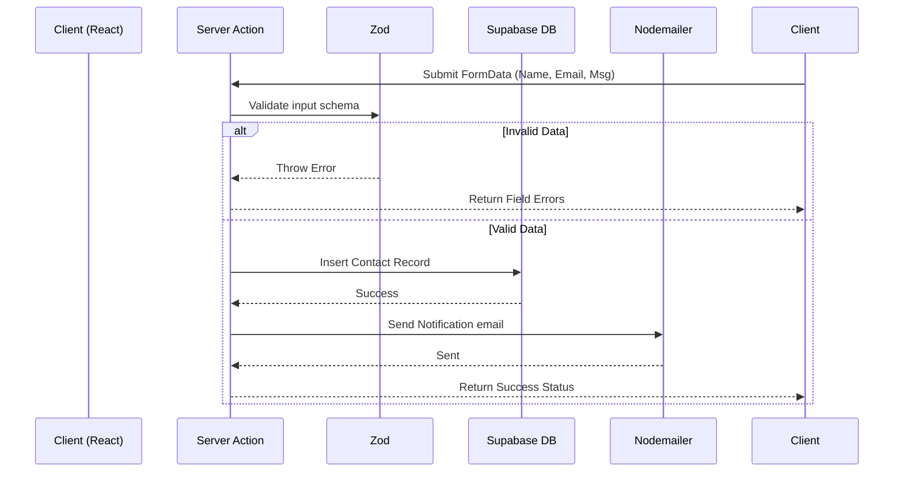

# NEUPC Website Documentation

## 1. Project Overview

The **Netrokona University Programming Club (NEUPC) Website** is a modern, responsive, full-stack web application designed to serve the club's members, guests, and administrative staff. It provides public information (events, blogs, achievements, gallery, roadmaps) and secure, role-based dashboards for internal operations (membership management, publishing, settings).

### Architecture & Tech Stack

*   **Framework:** Next.js 16+ (App Router)
*   **UI Library:** React 18+
*   **Styling:** Tailwind CSS (utility-first, responsive, and customizable)
*   **Language:** JavaScript (ES6+), **No TypeScript**
*   **Database & Auth:** Supabase (PostgreSQL, Row Level Security, Storage, Authentication)
*   **Rich Text / Code Editor:** TipTap & CodeMirror (for blog posts and roadmaps)
*   **Email Notifications:** Nodemailer (SMTP integration for verification, password resets, and notifications)
*   **Form Validation:** Zod (schema-based validation for server actions and client forms)
*   **Animations:** Framer Motion (for fluid page transitions, scroll-reveals, and interactions)

---

## 2. Public Pages

The public-facing pages serve as the primary marketing and informational hub. They use shared, reusable components to ensure a consistent dark-themed, modern aesthetic.

| Directory (`app/`) | Purpose | Key Shared Components Used |
| :--- | :--- | :--- |
| `page.js` (Home) | Landing page with hero, featured events, and CTAs. | `PageHero`, `CTASection`, `PageShell` |
| `about/` | Club history, mission, vision, and core values. | `MotionSection`, `PageShell` |
| `achievements/` | List of competitive programming achievements and accolades. | `FilterPanel`, `InlinePagination`, `MotionStagger` |
| `blogs/` | Knowledge hub with tutorials, news, and member posts. | `FilterPanel`, `FeaturedSpotlight`, `MotionStagger` |
| `committee/` | Directory of executive and advisory committee members. | `MotionStagger`, `PageHero` |
| `contact/` | Contact form and official communication channels. | `PageHero`, `MotionStagger` |
| `developers/` | Credits to the website's development team and tech stack. | `MotionCard` |
| `events/` | Upcoming, ongoing, and past events calendar and details. | `FilterPanel`, `FeaturedSpotlight`, `MotionStagger` |
| `gallery/` | Photo gallery from past events and workshops. | `FilterPanel`, `MotionStagger` |
| `join/` | Membership application form and benefits overview. | `PageHero`, `PageShell` |
| `roadmaps/` | Curated learning paths for various technical domains. | `FilterPanel`, `FeaturedSpotlight`, `MotionStagger` |

**Responsive Behavior:** All public pages default to a mobile-first approach. Grids (like blogs `grid-cols-1 md:grid-cols-2 lg:grid-cols-3`) collapse gracefully on small screens. Text sizes adjust using `sm:`, `md:`, and `lg:` breakpoints. 

---

## 3. Dashboards & Role Pages

The application utilizes a role-based access control (RBAC) system to serve customized dashboards. The main hub is `/account`.

*   **Guest Dashboard (`/account/guest`)**
    *   **Purpose:** The default view for newly registered users before formal membership approval.
    *   **Features:** Profile settings, membership application tracking, event participation history.
*   **Member Dashboard (`/account/member`)**
    *   **Purpose:** For officially approved NEUPC members.
    *   **Features:** Access to exclusive resources, member directory, blog publishing (if authorized), and personal activity tracking.
*   **Admin Dashboard (`/admin`)**
    *   **Purpose:** For committee executives and system administrators.
    *   **Features:** User management (approving membership requests, banning users), content moderation (approving blogs/events), site settings configuration, and analytics viewing.

---

## 4. Authentication & Authorization Flow

Authentication is handled securely via **Supabase Auth**, supplemented by custom routing logic.

### 4.1. Sign-Up & Login
1.  **User registers** via the `/login` (or `/join`) page.
2.  Supabase handles credential creation and dispatches an **Auth OTP / Verification Email**.
3.  Upon successful login, the `auth.js` middleware (or layout provider) verifies the session.

### 4.2. Role Resolution (`UserRoleProvider.js`)
*   The `users` table contains a `role` column (e.g., `guest`, `member`, `admin`, `alumni`).
*   The Next.js root layout fetches the user session and injects the role into the `<UserRoleProvider>`.
*   If a user holds multiple roles (or hierarchical permissions), the central `/account` hub acts as a routing junction, allowing them to select their active dashboard.

### 4.3. Protected Routes Middleware
*   `middleware.js` intercepts requests to `/account/*` and `/admin/*`.
*   If no session exists, it redirects to `/login`.
*   If an unauthorized role attempts to access `/admin`, it redirects them to `/account/guest` or a 403 page.

---

## 5. UI Components & Design System

The application features a centralized design system built on Tailwind CSS and Framer Motion.

### 5.1. Core Philosophy
*   **Dark Mode Native:** The default background is `#060810` (via `PageShell`), with subtle glassmorphism (`bg-white/5` to `bg-white/10`) for cards.
*   **Gradients & Glows:** Primary accents (`from-primary-500` to `to-secondary-500`) are used for primary buttons and text highlights.

### 5.2. Reusable Components (`app/_components/ui/`)
| Component | Usage | Description |
| :--- | :--- | :--- |
| `PageShell` | All public listing pages | Standardizes background color (`#060810`), min-height, and optional decorative gradient "blobs". |
| `PageHero` | Top of public pages | Handles headers, descriptions, dynamic statistics, and animated badge entrances. |
| `FilterPanel` | Blogs, Events, Roadmaps | A unified panel offering search inputs, category pills, sort dropdowns, and grid/list view toggles. |
| `FeaturedSpotlight` | Listings | Auto-advancing responsive carousel for highlighting featured items. |
| `CTASection` | Page bottoms | Conversion-focused block (e.g., "Join the Club", "Contact Us") with animated buttons. |

### 5.3. Animation Infrastructure (`motion.js`)
Animations are handled globally using `framer-motion` for fluid and highly performant UX.
*   **`MotionSection`:** Wraps horizontal sections with `whileInView` for scroll-reveal.
*   **`MotionStagger`:** Container that cascades child animations (`staggerChildren`). Wrap lists or grids with this.
*   **`MotionCard`:** Wraps card elements with `fadeUp` entry, `cardHover` (lift/scale), and `buttonTap` effects.
*   **`PageTransition`:** Uses `AnimatePresence` in `layout.js` to cross-fade when navigating between routes.

---

## 6. Forms & Validation

The application utilizes Next.js **Server Actions** combined with **Zod** for robust end-to-end validation.

### Workflow Example (Contact Form)
1.  **Client (`ContactClient.js`):** Collects user input (Name, Email, Subject, Message).
2.  **Local Validation:** Input is validated locally (e.g., required fields, Regex for email structure).
3.  **Submission:** The form `FormData` is passed to a Server Action (`submitContactFormAction`).
4.  **Server Action (`contact-actions.js`):**
    *   Parses the `FormData` fields.
    *   Validates it strictly using a Zod schema (`z.object({ email: z.string().email()... })`).
    *   If invalid, returns a field-specific error object.
    *   If valid, inserts the record into Supabase and triggers an email notification via Nodemailer.
    *   Returns a success boolean to the client to update the UI state.

---

## 7. Database & Supabase

Database interactions heavily rely on Supabase's PostgreSQL capabilities.

### Key Tables
*   **`users`:** Core user data, extending Supabase `auth.users` via triggers. Contains `role`, `full_name`, `avatar_url`, and the `is_online` heartbeat flag for active monitoring.
*   **`member_profiles`:** Extended data for approved members (student ID, batch, skills, bio).
*   **`committee_positions`:** Tracks historical and active committee roles (e.g., President, Gen Sec) linked to specific users.
*   **`events`:** Event details, start/end times, venue, and status (`upcoming`, `ongoing`, `completed`).
*   **`blogs`:** Articles written by users. Includes rich text HTML content, tags, and category relationships.
*   **`roadmaps`:** Curated JSON/Markdown structures defining learning paths.

### Relationships
*   A user can have exactly one `member_profile` (1-to-1).
*   A user can have many `blogs` (1-to-M / Author relation).
*   A user can have many `event_registrations` (M-to-M link table connecting users to events).

---

## 8. Email & Notification Flows

Emailing is managed server-side using **Nodemailer** connected to a secure SMTP service.

### Key Workflows
*   **Email Verification:** When a guest registers, Supabase sends a verification token to verify ownership.
*   **Account Approval:** When the Admin upgrades a `guest` to a `member`, a server action triggers a celebratory welcome email via Nodemailer.
*   **Contact Form Submissions:** The system emails the admin alias with the user's inquiry, while simultaneously sending an automated "We received your message" receipt to the user.

---

## 9. Development Workflow & Scripts

### Available Scripts
```json
"scripts": {
  "dev": "next dev",        // Starts development server on localhost:3000
  "build": "next build",    // Creates an optimized production Turbopack build
  "start": "next start",    // Runs the built app in production mode
  "lint": "next lint"       // Runs ESLint for syntax and pattern checking
}
```

### Conventions
*   **File Structure:** `app/` contains the router structure. `app/_components/` is for shared UI. `app/_lib/` is for utility helpers, server actions, and custom React hooks.
*   **Component Naming:** Server components use default directory names (e.g., `page.js`). Interactive client components are named explicitly (e.g., `BlogsClient.js`) with the `'use client'` directive at the top.
*   **No TypeScript:** As per project rules, all typing is implicit or handled via standard structural documentation and JS closures.

---

## 10. Deployment & Production Recommendations

### Deployment Context
The project is optimized for deployment on **Vercel** or any hosting supporting Next.js Server Components.

### Performance, Responsiveness & Accessibility Improvements
1.  **Image Optimization:** Ensure all dynamic images (avatars, blog thumbnails) use the Next.js `<SafeImg />` wrapper with proper sizes to prevent Cumulative Layout Shift (CLS).
2.  **Caching:** Leverage Next.js `unstable_cache` or standard `fetch` caching for high-traffic public reads (e.g., fetching upcoming events or popular blogs). This reduces unnecessary database querying.
3.  **Accessibility (a11y):**
    *   Maintain distinct focus states (`focus:ring-2 focus:ring-primary-500`) on all interactive forms and buttons. The form inputs on pages like Contact and Login demonstrate this.
    *   Ensure ARIA labels are added to icon-only buttons (like Social Media links and FAQ toggles).
    *   Ensure color contrast ratios exceed WCAG AA standards over semi-transparent backgrounds.
4.  **Responsive Best Practices:** Ensure `break-words` and `truncate` is heavily utilized on text elements like Email Addresses to prevent mobile overflowing in tight viewports.

---

## 11. Diagrams & Visuals

### Authentication & Role Flow



### Server Action Form Validation Flow


